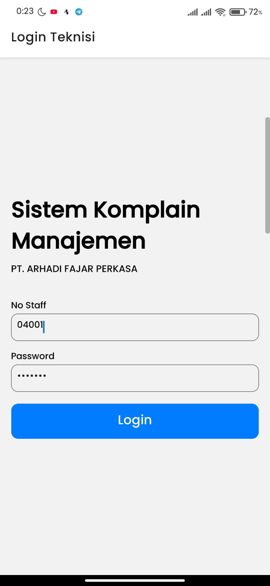
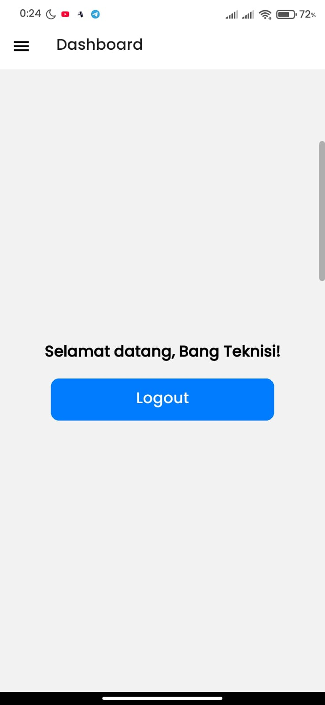
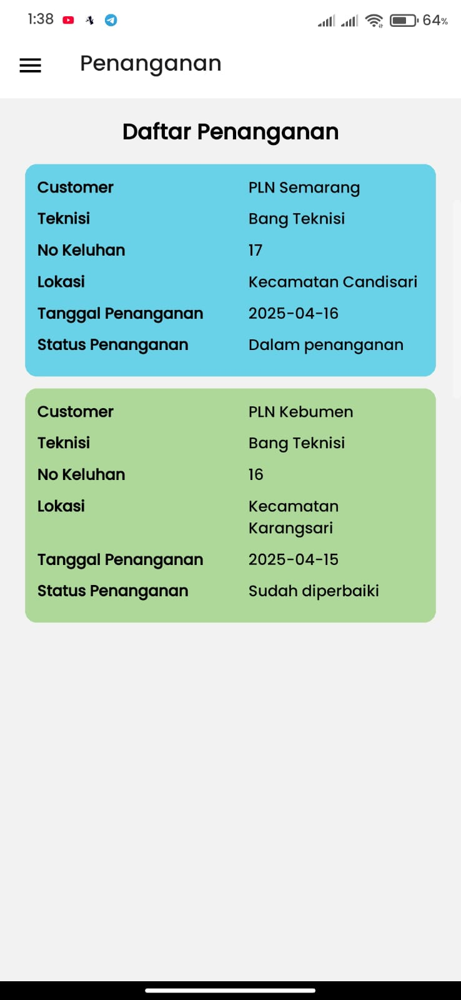
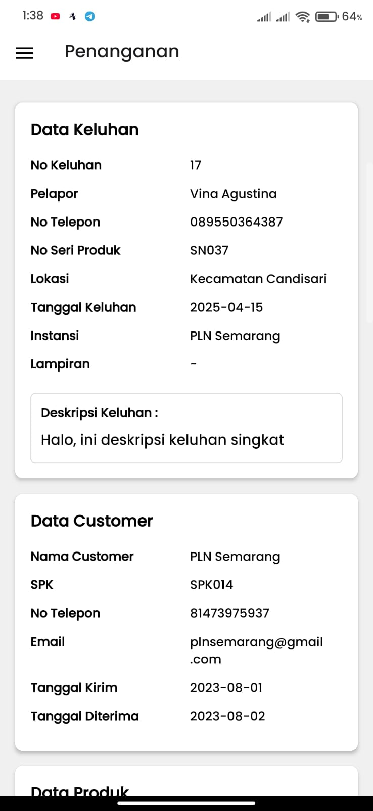
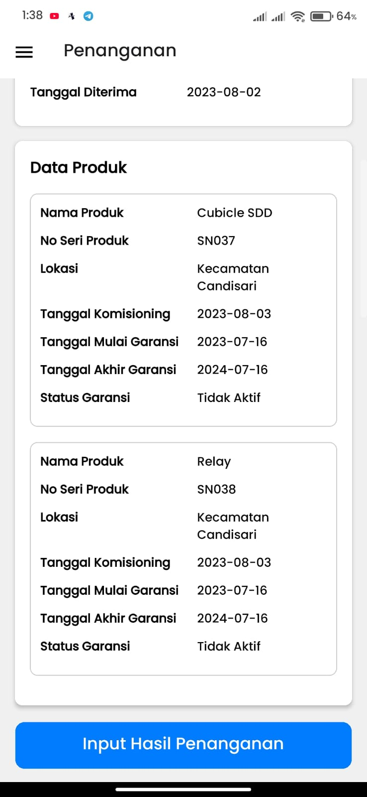
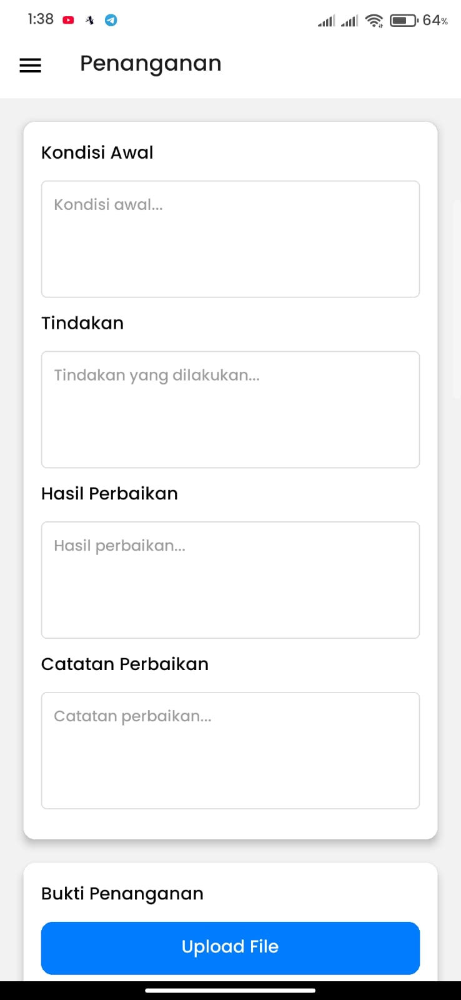
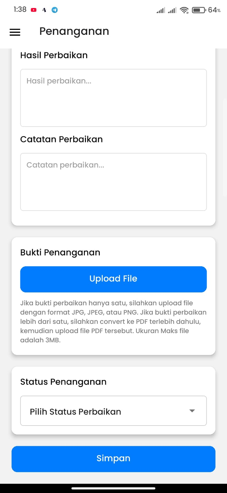

# 📌 Sistem Komplain Manajemen Berbasis Web dan Mobile

Proyek tugas akhir ini merupakan implementasi sistem manajemen komplain berbasis web dan mobile yang bertujuan untuk meningkatkan pelayanan terhadap pelanggan. Sistem ini memudahkan pelanggan dalam mengajukan keluhan dan membantu petugas internal perusahaan untuk memantau serta menangani komplain secara efisien.

---

## 📖 Deskripsi Singkat

Sistem ini dikembangkan untuk perusahaan distributor produk-produk listrik, dan mendukung lima jenis pengguna:

-   **Pelanggan**: Mengajukan keluhan produk dan memantau statusnya.
-   **Staff Aftersales**: Memvalidasi dan memantau keluhan serta menerima laporan penanganan dari teknisi.
-   **Teknisi**: Menangani keluhan yang diteruskan oleh staff aftersales, serta mengirim laporan hasil penanganan.
-   **Staff Marketing**: Mengelola data penjualan (input, edit, dan hapus).
-   **Manager Marketing**: Memantau seluruh data pengguna kecuali teknisi, serta memiliki akses khusus untuk mengelola data user sistem (buat, edit, hapus akun pengguna).

Sistem terdiri dari:

-   **Aplikasi Web (Laravel 10)** untuk seluruh user.
-   **Aplikasi Android (React Native + Expo)** khusus teknisi.

---

## ⚙️ Teknologi yang Digunakan

-   Laravel 10
-   Laravel Sanctum (untuk autentikasi token API)
-   MySQL
-   Bootstrap 5
-   React Native (Expo CLI)
-   Axios (untuk konsumsi API)

---

## 🌐 Fitur pada Aplikasi Web

### 👤 Pelanggan

-   Mengajukan keluhan terhadap produk
-   Melihat status keluhan

### 🧑‍💼 Staff Aftersales

-   Login sebagai staff
-   Melihat daftar keluhan dari pelanggan
-   Memvalidasi keluhan dan meneruskan ke teknisi
-   Menerima laporan hasil penanganan dari teknisi
-   Memvalidasi dan menyelesaikan proses penanganan menjadi 'Selesai' setelah mendapat laporan dari Teknisi
-   Memantau progres setiap keluhan

### 👨‍🔧 Teknisi

-   Login sebagai Teknisi opsional melalui web ataupun aplikasi android
-   Melihat daftar tugas penanganan (dari staff aftersales)
-   Melihat detail keluhan
-   Mengisi laporan hasil penanganan
-   Melihat riwayat penanganan (khusus di web)

### 📊 Staff Marketing

-   Login sebagai staff marketing
-   Mengelola data penjualan
-   Mengelola data customer
-   Mengelola data produk

### 👨‍💼 Manager Marketing

-   Login sebagai manager
-   Memantau seluruh data dari semua pengguna, kecuali teknisi
-   Hanya bersifat melihat data (read-only) kecuali untuk fitur khusus
-   **Fitur khusus**: Mengelola data user sistem (admin user)

---

## 📱 Fitur pada Aplikasi Android (Untuk Teknisi)

Aplikasi Android hanya digunakan oleh teknisi sebagai alat bantu ketika berada di lapangan.

### 👨‍🔧 Alur Penggunaan:

1. **Login**  
   Teknisi login menggunakan akun yang telah diberikan.

2. **Daftar Keluhan Masuk**  
   Menampilkan daftar keluhan dari pelanggan yang sudah divalidasi oleh staff aftersales.

3. **Detail Keluhan**  
   Menampilkan rincian keluhan untuk ditangani teknisi.

4. **Form Penanganan**  
   Setelah menyelesaikan penanganan, teknisi mengisi laporan hasil penanganan.

## 📸 Cuplikan Layar

**Login Screen**

    

**Home Screen**

    

**List Keluhan**

    

**Halaman Penanganan**

    
    

**Halaman Input Hasil Penanganan**

    
    

---

## 🧑‍💻 Informasi Login untuk Role Petugas

Berikut adalah informasi login untuk mencoba masing-masing role pada sistem (kecuali pelanggan, karena tidak menggunakan login dan hanya mengisi data di form pengajuan keluhan):

| Role              | No Petugas | Password         |
| ----------------- | ---------- | ---------------- |
| Staff Aftersales  | 02001      | aftersales       |
| Teknisi           | 04001      | teknisi          |
| Staff Marketing   | 03001      | marketing        |
| Manager Marketing | 01001      | managermarketing |

---

## 🌐 Demo Aplikasi

-   🔗 **Aplikasi Web**: [https://helloluthfiii.my.id/aftersales/admin](https://helloluthfiii.my.id/aftersales/admin)

    -   Anda dapat login menggunakan akun demo di atas untuk menjelajahi fitur aplikasi web dari masing-masing user.
    -   Tidak tersedia fitur untuk pelanggan login, pelanggan hanya mengisi form keluhan yang sudah disediakan [disini](https://helloluthfiii.my.id/aftersales/guest)
    -   Untuk Demo alur data dari mulai pelanggan mengajukan keluhan sampai keluhan itu selesai ditangani, anda dapat menggunakan data yang ada dibawah ini supaya datanya valid karena data keluhan yang diinputkan harus terdapat pada database penjualan, jika tidak ada maka data yang diajukan tidak akan valid.
        -   No Seri Produk : SN031
        -   Lokasi : Kecamatan Gamping
        -   Nama Institusi : PLN Sleman
            selain data tersebut, bisa bebas anda isi sesuai keinginan anda. silahkan, dapat dimulai dari pengajuan keluhan sebagai [pelanggan](https://helloluthfiii.my.id/aftersales/guest).

-   📱 **Aplikasi Android (Mobile)**:
    -   Untuk dapat menjalankan aplikasi Android, bisa dilihat pada dokumentasi repository aplikasi mobile di [sini](https://github.com/username/repo-mobile).
    -   Role yang bisa mengakses aplikasi Android: **Teknisi** saja.

---

## 📌 Catatan Pengembangan

-   Aplikasi Android dikembangkan khusus untuk teknisi sebagai bagian dari konsentrasi _Smart Application System_ dalam tugas akhir.
-   Teknisi juga dapat login melalui web, namun versi mobile mempermudah pekerjaan di lapangan.
-   Proyek ini dikembangkan dengan pendekatan REST API, menggunakan Laravel sebagai backend dan React Native sebagai frontend mobile.
